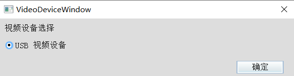
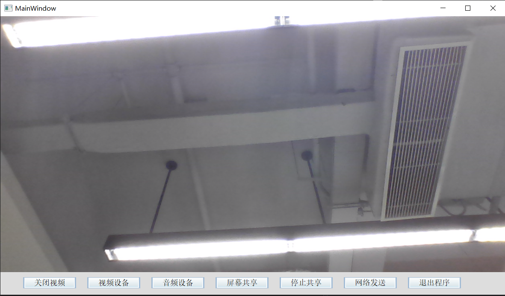
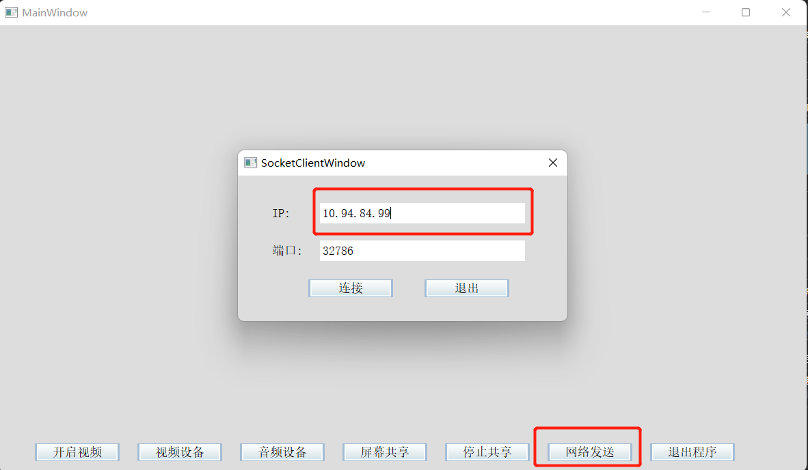
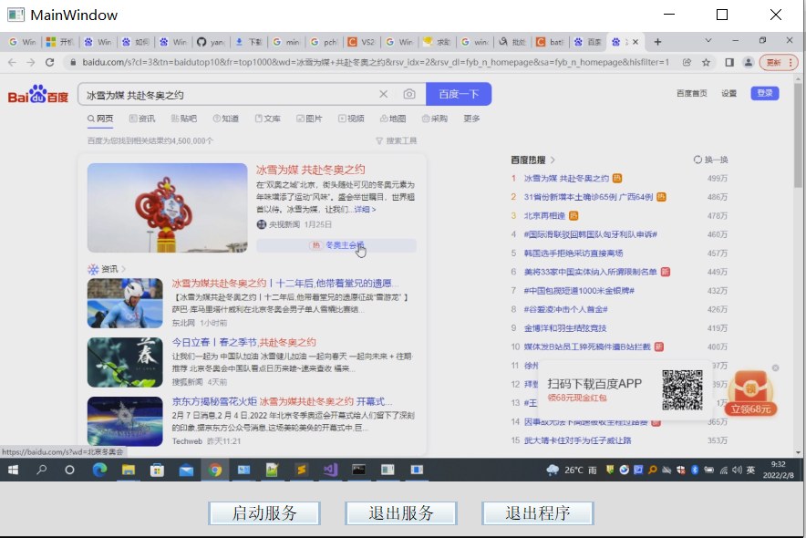
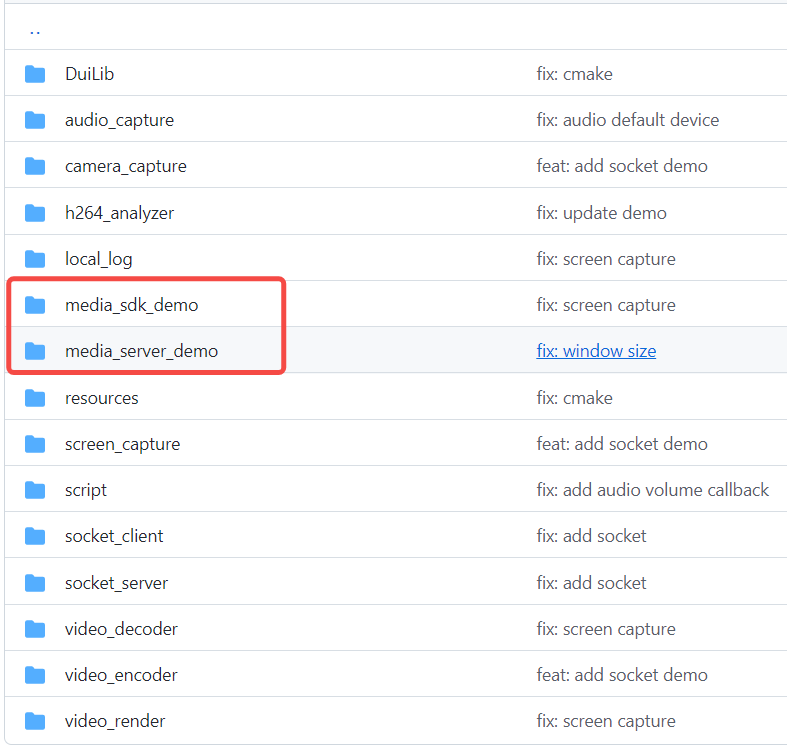

# MediaSDK

Windows 下媒体相关的 sdk，包含音频的枚举，视频的采集、渲染、编解码，以及屏幕的采集，本地日志等内容

## 模块介绍

### 音频

音频设备枚举


### 摄像头

摄像头的枚举和采集分别使用了 dshow 和 media foundation 两种

摄像头枚举

.

摄像头采集渲染



### 编码

编码使用了 x264，x265，FFmpeg，OpenH264，QSV

### 解码

解码使用了 FFmpeg，QSV（目前还在调试中） 两种

### 渲染

渲染使用了 D3D9，SDL2，OpenGL

### 屏幕采集

屏幕采集使用了 DXGI，GDI，以及 Magnification（包含 HOOK）

窗口枚举


屏幕采集默认会将数据存在本地，如果要通过网络发送先点击网络发送，然后填上对端的 ip 地址（先启动 server 端），连接成功之后点击屏幕共享进行共享



### 接收端渲染

首先先要启动服务，表示启动一个 socket server




### 本地日志

### Demo

每一个模块都有单独的 demo，另外还有两个总的 demo，分别是 media_sdk_demo 作为发送端，media_server_demo 作为接收端



## 编译运行方法

```bash
git clone https://github.com/yangpan4485/WindowsMediaSDK.git
cd WindowsMediaSDK
md build
cd build
cmake ..
然后打开 media_sdk.sln 编译
```

接收端

1、将 media_server_demo 设为启动项目

2、点击启动服务，启动 socket server

3、接下来启动发送端

发送端

1、将 media_sdk_demo 设为启动项目

2、点击网络发送，输入服务端的 ip 地址，然后开始连接

3、点击屏幕共享，选择要分享的内容进行共享，目前只对屏幕共享进行发送

如果编译出现文件路径找不到的问题，需要自己处理

